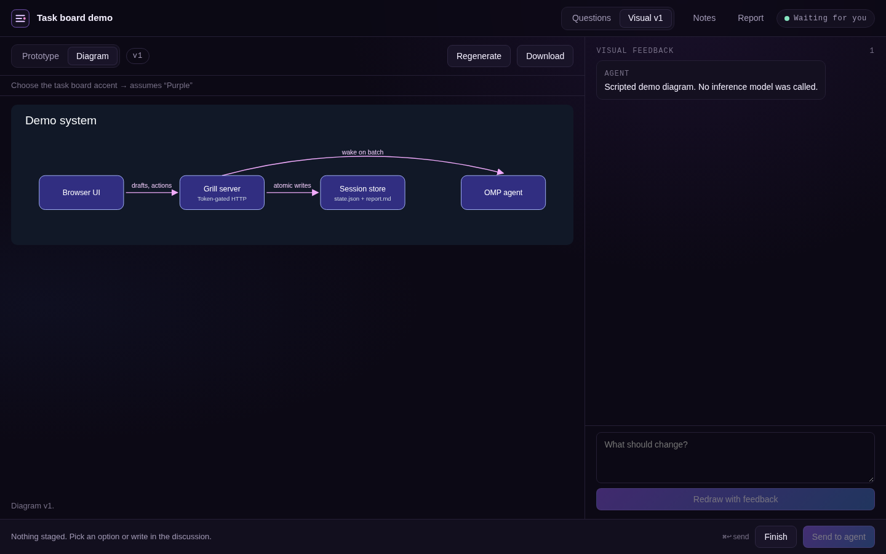
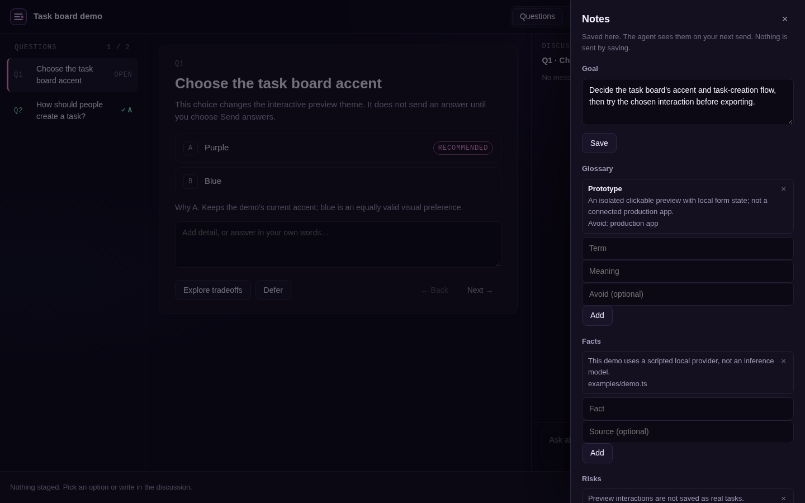
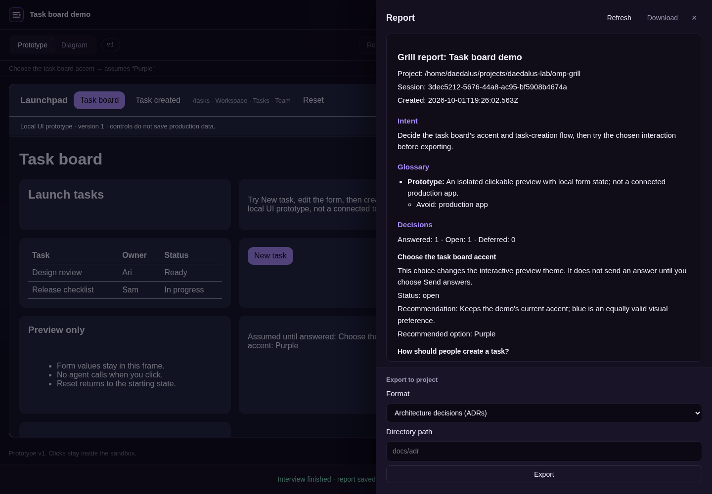

<div align="center">


<h1>omp-grill</h1>

<p>Design interviews in your browser or OMP terminal.</p>

<p>
  <a href="https://github.com/can1357/oh-my-pi"></a>
  <a href="https://bun.sh"></a>
  <a href="LICENSE"></a>
</p>

<p>
  <a href="#summary">Summary</a> ·
  <a href="#quick-start">Quick start</a> ·
  <a href="#token-efficiency">Token efficiency</a> ·
  <a href="#exports">Exports</a> ·
  <a href="#terminal">Terminal</a>
  <br>
  <a href="#commands">Commands</a> ·
  <a href="#settings">Settings</a> ·
  <a href="CHANGELOG.md">Changelog</a> ·
  <a href="https://github.com/Shadorain/omp-grill/issues">Report a bug</a>
</p>

</div>

<h2 align="center">Summary</h2>

> Keep model work focused on questions and decisions.

Grill aims to be token-efficient at every step. Answer questions, discuss tradeoffs, try a clickable prototype, and save the decisions as a report. The agent handles interview reasoning; code handles the UI, drafts, rendering, and exports.


<details>
<summary>More screenshots</summary>

### Interactive prototypes

Click through a screen preview without calling the agent. The model supplies a structured spec, not HTML or JavaScript. Grill renders it locally; send feedback only when you want it redrawn.


### System diagrams

Ask for a diagram to review architecture or a flow. Grill renders the agent's structured spec into SVG locally. A prototype is optional when the topic is a screen.



### Interview notes

Save the goal, glossary, facts, and risks without a model call. The agent sees changes on your next send.



### Reports and exports

Review the report and choose an export format after finishing. Preview, Finish, and Export run locally without model calls.



### Terminal inspector

Stage options, write answers, and discuss questions without leaving OMP.


</details>

## Quick start

Requires [OMP](https://github.com/can1357/oh-my-pi) 18.4.4 or later. Run these commands inside OMP:

```text
/marketplace add Shadorain/omp-grill
/marketplace install grill@omp-grill
```

Restart OMP after installing or updating. Then start an interview:

```text
/grill How should our task board handle task creation?
```

1. Open the URL OMP prints. Keep it private. The full URL contains an access token.
2. Pick an option or write your own answer. Add a discussion message if you want to question the recommendation.
3. Click **Send N to agent**, or press Cmd/Ctrl+Enter. Answers and messages autosave locally as drafts. Batch several together instead of starting a model turn for every edit.
4. Click **Finish** to save `report.md` in the local interview folder. Use Export to copy it into your project.

Questions, replies, and visual requests use your OMP provider. The interface, draft storage, and report generation use no model tokens. Session files stay on your machine.

## Token efficiency

Grill keeps model calls for interview reasoning and delegates routine work to code.

| Step | How Grill saves model work |
| --- | --- |
| Before an interview | Grill tools stay hidden by default, so their schemas do not occupy model context until needed. |
| Drafting | Edits and autosave stay local. Send batches answers and discussion messages into one submission. |
| Sending | The agent receives compact actions and related questions. Relevant discussion includes only recent entries, not the full stored history. |
| Recovering context | The agent can request compact decisions, open questions, and the pending batch instead of replaying the full interview. |
| Trying visuals | The agent emits structured specs. Code renders diagrams and prototypes; prototype clicks do not call the model. |
| Finishing and exporting | Code writes reports, ADRs, beads plans, SVG, and HTML from saved state. No model-written UI or extra document-generation turn. |

Questions, replies, option analysis, and visual generation or regeneration still use model tokens. Total usage also depends on your surrounding OMP session context and model.

## Using an interview

**Explore tradeoffs** asks the agent to compare options. **Defer** sets a question aside and lets you record when to revisit it. **Reopen** returns a recorded question to the discussion. These actions and visual requests start an agent turn immediately, without waiting for Send.

The browser tab title counts open questions while it is your turn. On supported secure origins, such as localhost, you can allow desktop notifications for replies while the tab is hidden.

Drafts survive reloads and resume. If two tabs edit the same drafts, the page lets you choose which copy to keep. The other copy remains recoverable.

If an agent turn stops, the page keeps the batch and shows the error. Run `/grill resume` in the owning OMP session to retry it. An attached interview keeps its URL.

### Multiple interviews and worktrees

Use `/grill use <id>` to select the interview that commands and agent replies target. `/grill sessions` lists saved interviews across the repository's linked worktrees.

`/grill resume` restores a paused or errored interview. `/grill fork` starts a new one with a finished interview's goal, glossary, facts, and risks, so you can reuse that context instead of entering it again. Fork does not copy questions or answers.

## Exports

Finish the interview first. Every export format is generated locally from saved state, without another model call. In the Report drawer, choose a format, optionally enter a destination, and click Export. You can also use OMP commands:

```text
/grill export report docs/task-board.md
/grill export adr
/grill export beads
```

| Format | Default destination | What it writes |
| --- | --- | --- |
| `report` | `docs/grill-report.md` | Markdown decisions and discussion. |
| `adr` | `docs/adr/` | One numbered architecture decision record per answered durable decision. |
| `beads` | `docs/grill-beads.json` | A `bd create --graph` plan with an epic, tasks, and dependency edges. |
| `diagram` | `docs/grill-diagram.svg` | The saved system diagram. |
| `prototype` | `docs/grill-prototype.html` | The saved interactive prototype. |

Paths are relative to the checkout where the interview started, even if you resume it from another worktree. Existing files require overwrite confirmation in the browser or `--force` in the command.

ADRs continue numbering after existing records. They contain the recorded decision and explored alternatives, without inferred consequences. Diagram and prototype exports require a saved visual of that kind.

To import a beads plan, run this in your project:

```sh
bd create --graph docs/grill-beads.json
```

Include a full Linear issue URL in the interview topic if you want the parent epic linked to it. Grill uses that URL as `external_ref`. It does not guess the workspace from a bare ID such as `CHR-144`.

## Terminal

Run `/grill tui` for the selected interview, or `/grill tui <topic>` to start one in the terminal. The browser remains available. As in the browser, drafting and saving edits use no model tokens; Send batches them for the agent.

| Key | Action |
| --- | --- |
| `j` / `k` | Move between questions. |
| `a` through `d` | Stage an option. |
| `i` | Write an answer, including questions with no options. |
| `m` | Write a discussion message. |
| `x` | Defer with an optional revisit condition. |
| `Enter` / `Esc` while writing | Save or discard the edit. |
| `Enter` outside the editor | Send drafts. |
| `e` | Explore tradeoffs. |
| `f` twice | Finish. |
| `Tab` | Switch between the question and discussion. |
| `Esc` / `q` outside the editor | Close the inspector. The interview stays open. |

While the agent works, drafts remain editable. Sending, exploring, deferring, and finishing wait for its reply.

## Commands

<details>
<summary>All commands</summary>

Run `/grill` to list open interviews and commands. Tab completion suggests commands, interview IDs, question IDs, options, export formats, and settings.

| Command | Action |
| --- | --- |
| `/grill <topic>` | Start an interview. |
| `/grill tui [topic]` | Open the terminal inspector, or start an interview there. |
| `/grill tui off` | Turn off terminal mode without closing the interview. |
| `/grill use <id>` | Select an open interview. |
| `/grill url` | Show its private URL. |
| `/grill questions` | List its questions. |
| `/grill answer <id> <option> [note]` | Record an option and optional note. |
| `/grill answer <id> -- <text>` | Record a written answer. |
| `/grill reply <id> <text>` | Send a message about a question. |
| `/grill pause` | Pause the selected interview. |
| `/grill resume [id]` | Resume a paused or errored interview. |
| `/grill history [id]` | View a finished interview. |
| `/grill sessions` | List saved interviews for this repository. |
| `/grill finish` | Finish and save the report. |
| `/grill export <kind> [path] [--force]` | Export an artifact into the project. |
| `/grill fork [id]` | Start a new interview with a finished interview's context. |
| `/grill config [key] [value]` | Show or change settings. |

</details>

## Settings

Use `/grill config` to see current values. For example:

```text
/grill config host 127.0.0.1
/grill config allowAgentStart true
```

| Setting | Default | Meaning |
| --- | --- | --- |
| `host` | `0.0.0.0` | Listen on all IPv4 interfaces. Set `127.0.0.1` for local access only. |
| `port` | `0` | Pick a free port. A fixed port applies to the first interview; later interviews use free ports. |
| `allowAgentStart` | `false` | Let the agent start interviews from natural-language requests. |

By default, start or resume an interview with `/grill` before the agent can use Grill tools. Pausing or finishing the last open interview hides them again, keeping their schemas out of model context when Grill is idle. Set `allowAgentStart` to `true` to keep them available. This change takes effect immediately.

After changing `host` or `port`, pause and resume the interview to restart its server. A fixed port already in use causes an error.

Settings live in `~/.omp/grill/settings.json`. You can edit that file directly. Set `OMP_GRILL_HOME` to move settings and session files to another directory.

### Network safety

The default listener is reachable on your LAN. HTTP is unencrypted. Use a trusted network, never expose Grill to the public internet, and keep interview URLs private.

For a remote OMP host, set `host` to `127.0.0.1` and forward the port over SSH:

```sh
ssh -N -L 43127:127.0.0.1:43127 user@omp-host
```

Replace `43127` with the port OMP prints, then open the forwarded URL on localhost.

## Development

```sh
git clone https://github.com/Shadorain/omp-grill.git
cd omp-grill
bun install
bun test
bun run typecheck
bun run demo
```

The demo uses a scripted local provider and no inference tokens. Open its printed `DEMO_URL`. Ctrl+C stops it and removes temporary files.

For changes to the extension, read the [architecture](docs/architecture.md), [command guide](docs/commands.md), and [testing guide](docs/testing.md).

Inspired by [grill-with-ui](https://github.com/jasonku09/grill-with-ui). Grill renders diagrams and prototypes from structured specs instead of running model-written HTML.

## License

[MIT](LICENSE).
