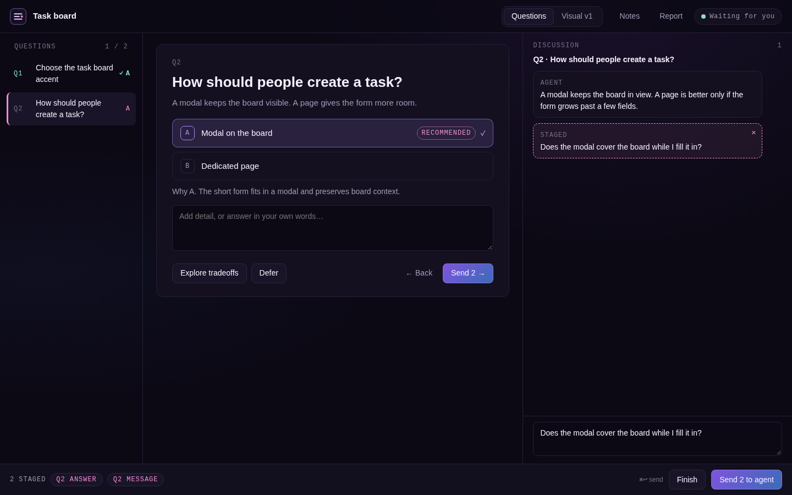
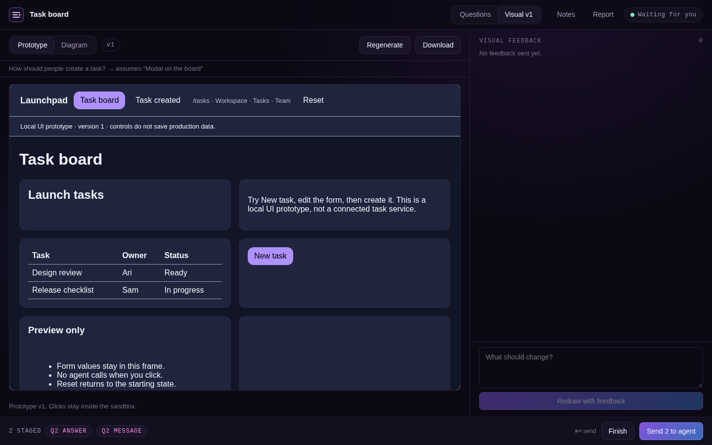
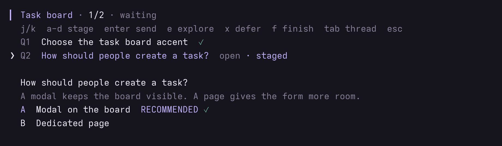

# omp-grill

Design interviews for [OMP](https://github.com/can1357/oh-my-pi). One decision at a time, with a recommendation and a discussion thread. Choices stay staged until one Send. The extension keeps the page, the drafts, and a local `report.md`.



Requires OMP 18.4.4 or later. Restart OMP after installing or updating.

## Install

```text
/marketplace add Shadorain/omp-grill
/marketplace install grill@omp-grill
```

Then `/grill <topic>`, or ask OMP to start an interview. The model opens the page with `grill_publish`. No bundled skill.

## Use

Open the URL OMP prints. The fragment is a bearer token. Keep that URL private.

Pick an option or type an answer. It is staged, not sent, until **Send N to agent** (⌘/Ctrl+Enter). A discussion message stages the same way. Explore, Defer, Reopen, and Visual go out immediately. Finish writes `report.md`.

Several grills can be open. Commands and the agent act on the selected one.


| Command                              |                                                      |
| ------------------------------------ | ---------------------------------------------------- |
| `/grill <topic>`                     | Start another interview.                             |
| `/grill tui [topic|off]`             | Open it in the session terminal, or leave that view. |
| `/grill use <id>`                    | Select which open grill commands target.             |
| `/grill url`                         | Print the private URL.                               |
| `/grill questions`                   | List questions.                                      |
| `/grill answer <id> <option> [note]` | Record an option.                                    |
| `/grill answer <id> -- <text>`       | Free-text answer.                                    |
| `/grill reply <id> <text>`           | Message the agent about a question.                  |
| `/grill pause`                       | Pause the selected grill.                            |
| `/grill resume`                      | Open a paused or errored grill.                      |
| `/grill history`                     | Open a finished grill's locked page.                 |
| `/grill sessions`                    | List saved grills for this project.                  |
| `/grill finish`                      | Finish and write `report.md`.                        |


`/grill` with no arguments lists what is open. Autocomplete fills the rest.



Visual defaults to a diagram. A prototype is a sandboxed screen preview: clicks inside it never call the agent. Skip it unless the interview is about something people will see.

### `/grill tui`

If you don't want a fancy GUI, opt for a fancy TUI right from your session! All the same commands work, switch anytime back to GUI also!



In the terminal, `j`/`k` move, `a`-`d` stage, `enter` sends, `e` explores, `x` defers, `f` twice finishes, `tab` shows the discussion. `esc` closes the inspector. The browser page stays up.

## Configuration

Optional `~/.omp/grill/settings.json`. Missing file means the defaults. Read when a server starts. `/grill pause` then `/grill resume` picks up an edit.


| Key    | Default   |                                                                              |
| ------ | --------- | ---------------------------------------------------------------------------- |
| `host` | `0.0.0.0` | Bind address.                                                                |
| `port` | `0`       | Free port. A fixed port applies to the first grill only, and fails if taken. |


```json
{ "host": "127.0.0.1", "port": 43127 }
```

`OMP_GRILL_HOME` moves settings and sessions together. Default is `~/.omp/grill`.

`0.0.0.0` listens on every IPv4 interface. Trusted LAN only. HTTP is unencrypted, so the token is not enough for a public network. For a remote host, forward the real port: `ssh -N -L 43127:127.0.0.1:43127 user@omp-host`.

Session files stay on the machine. The page, drafts, and report do not spend model tokens. Questions, replies, and requested visuals go through OMP's configured provider.

## Development

```sh
git clone https://github.com/Shadorain/omp-grill.git
cd omp-grill
bun install
bun test
bun run demo
```

`bun run demo` prints a `DEMO_URL` and uses a scripted provider. No inference tokens. Ctrl+C removes the temporary demo directory.

Inspired by [grill-with-ui](https://github.com/jasonku09/grill-with-ui). Grill renders its own diagram and prototype specs. It does not run model-written HTML.

## License

[MIT](LICENSE)